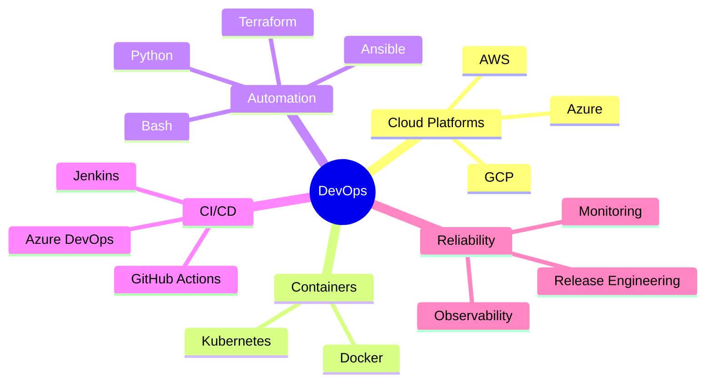

# Hi 👋, I'm Ankit Pipalia

### DevOps Engineer | Cloud & Platform Automation | CI/CD Specialist

I design, automate, and operate reliable cloud-native infrastructure with a focus on Kubernetes, Terraform, Jenkins, Azure DevOps, AWS, CI/CD, and Ansible.

---

## 👨‍💻 Profile Dashboard

<table>
  <tr>
    <td width="60%">

### 🚀 About Me

- 🔭 I’m currently working on **Kubernetes, Terraform, Jenkins, Azure DevOps, AWS, CI/CD, and Ansible**.
- 🌱 I’m focused on improving **cloud automation, platform engineering, infrastructure as code, and DevOps delivery pipelines**.
- 👨‍💻 All of my projects are available on [GitHub](https://github.com/ankitpipalia).
- 📄 Know more about my experience in my [resume](./Resume.pdf).
- 📫 Reach me at **ankit.pipalia009@gmail.com**.

    </td>
    <td width="40%">

### ⚡ Quick Links

- [GitHub Profile](https://github.com/ankitpipalia)
- [LinkedIn](https://linkedin.com/in/ankitpipalia)
- [Twitter / X](https://twitter.com/ankitpipalia)
- [Resume](./Resume.pdf)

    </td>
  </tr>
</table>

---

## 🧰 Tech Stack

### Cloud & DevOps

### Languages & Tools

---

## 📊 GitHub Analytics

 
 

 
 

 
 

---

## 🎯 DevOps Focus Areas

---

## 🤝 Connect With Me

